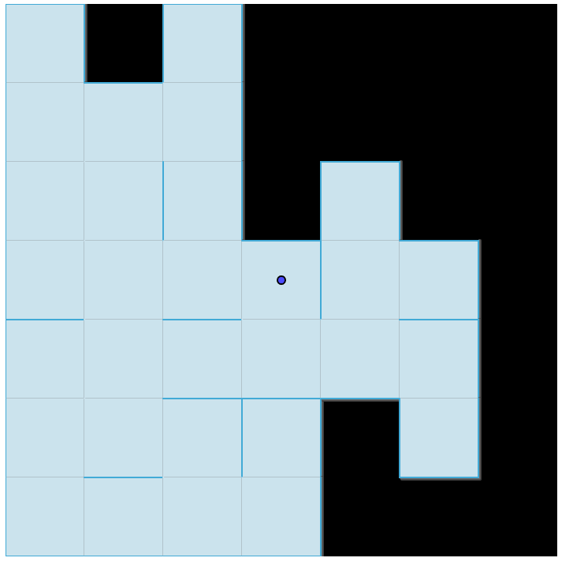

# p5js_gleam

[](https://hex.pm/packages/p5js_gleam)
[](https://hexdocs.pm/p5js_gleam/)

A simple game library providing [p5js](https://p5js.org/) bindings for Gleam in a functional style to make basic games and animations. Heavily inspired by the Racket library 2htdp/universe.

This project is primarily made up of

- A [bun](https://bun.sh/) script that is used to generate bindings for p5js class methods
  - Script is based on script created for [glare](https://github.com/Enderchief/glare/tree/master/scripts)
- A wrapper game engine that provides a functional interface to p5js

## Showcase

An example generated maze


An example ball spawner
[](./assets/ball_spawner.mp4)

## Using the library

Add the library to your project by running the following command

```bash
gleam add p5js_gleam
```

Then add a call to the `start_sketch` function in your main function.

```gleam
import p5js_gleam.{type P5, SketchConfig}
import p5js_gleam/bindings as p5
import gleam/option

fn setup(p: P5) -> String {
  p5.create_canvas(p, 800.0, 600.0)
  "Hello, world!"
}

fn draw(p: P5, state: String) {
  p5.background(p, "#ffffff")
  p5.fill(p, "#000000")
  p5.text(p, state, 400.0, 300.0)
}

pub fn main() {
  p5.start_sketch(SketchConfig(
    init: setup,
    draw: draw,
    on_tick: option.None,
    on_key: option.None,
    on_mouse: option.None,
  ))
}
```

Afterwards you will need to build your project and include it in an html file. The html file must import p5js as a module before the generated javascript file. The easiest way to do this is to load the p5js library from a CDN.

```html
<!doctype html>
<html lang="en">
  <head>
    <meta charset="UTF-8" />
    <meta http-equiv="X-UA-Compatible" content="IE=edge" />
    <meta name="viewport" content="width=device-width, initial-scale=1.0" />
    <title>Ball Spawner</title>
    <script src="https://cdn.jsdelivr.net/npm/p5@1.9.2/lib/p5.js"></script>
    <script type="module">
      import { main } from "./ball_spawner.js";
      main();
    </script>
  </head>
  <body></body>
</html>
```

To see the library in action you can serve one of the examples in the `examples` directory.

## Generating FFI Bindings

To generate the FFI bindings you will need bun installed. Once you have bun installed run

```bash
bun run ./scripts/generate_p5.ts
```
